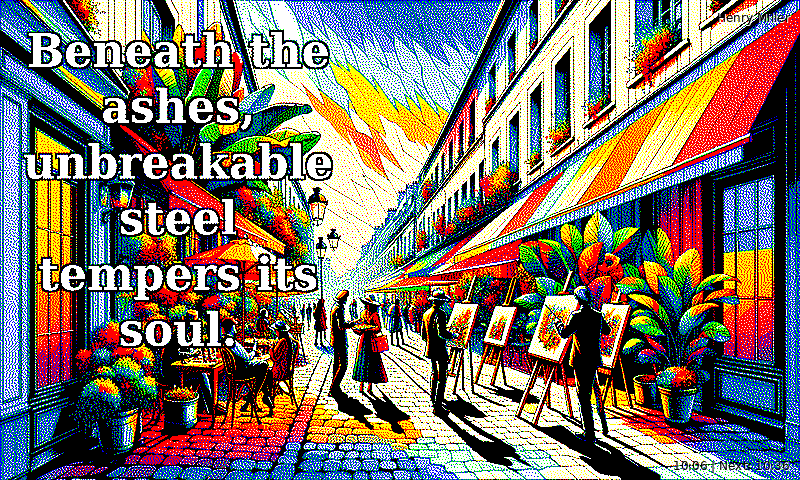
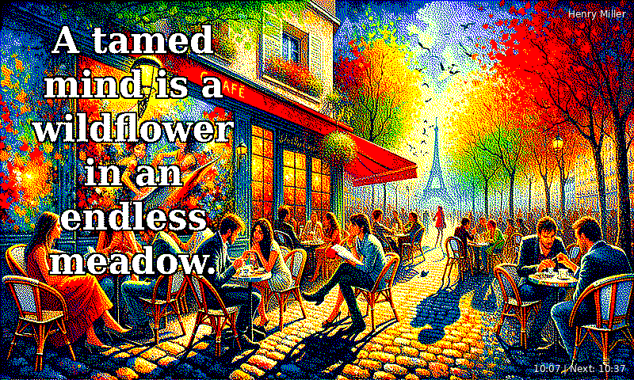

# Pi Ink Image Server

<div align="center">

**AI-powered dynamic art generator for e-ink displays**

[](https://buymeacoffee.com/integral.llc)

Generate stunning, gallery-worthy artwork optimized for e-ink displays using DALL-E 3 and GPT-4. Features daily artist-inspired styles, inspirational quotes, and automatic color palette optimization.





</div>

## Features

- **AI Art Generation** — DALL-E 3 creates vibrant, high-contrast artwork optimized for e-ink
- **1095 Artists Database** — 3 artists per day rotating every 8 hours, inspired by birthdays
- **AI Unleashed Mode** — 10% chance for mind-bending impossible art (4D geometry, synesthesia, etc.)
- **Dynamic Quotes** — GPT-4 generated inspirational quotes overlay each image
- **Smart Color Quantization** — Floyd-Steinberg dithering with saturation boost for vivid e-ink colors
- **Home Assistant Integration** — Camera entity, status sensors, webhook refresh triggers
- **Multi-Display Support** — Automatically adapts to different e-ink display sizes and color depths
- **Time-Aware Scenes** — Generates morning, afternoon, evening, and night themed artwork

## Supported Displays

| Colors | Type | Example Displays |
|--------|------|------------------|
| 2 | Monochrome | Kindle, basic e-ink |
| 3 | Tri-color | Inky pHAT (red/yellow) |
| 6 | Spectra 6 | Inky Impression 7.3" (2025) |
| 7 | ACeP 7-color | Older Inky Impression |

## Architecture

```
┌─────────────────────────┐         ┌─────────────────────────┐
│  Server (Ubuntu/Linux)  │  HTTP   │  Raspberry Pi Zero 2W   │
│  FastAPI + OpenAI       │◄───────►│  E-Ink Display Client   │
│  DALL-E 3 + GPT-4       │         │  Auto-refresh every 30m │
└─────────────────────────┘         └─────────────────────────┘
                                             │
                                             ▼
                                   ┌─────────────────────────┐
                                   │  E-Ink Display          │
                                   │  800x480 to 4096x4096   │
                                   │  2-7 colors             │
                                   └─────────────────────────┘
```

## Quick Start

### Server Setup

```bash
# Clone and install
git clone https://github.com/integral-llc/pi-ink-image-server.git
cd pi-ink-image-server
python3 -m venv .venv && source .venv/bin/activate
pip install -e .

# Configure
cp .env.example .env
# Edit .env and add your OPENAI_API_KEY

# Run
python server.py
```

### Client Setup (Raspberry Pi)

```bash
# Copy client to Pi
scp -r pi_client/ piroot@your-pi:~/pi2w-client/

# On the Pi
cd ~/pi2w-client
pip install -r requirements.txt

# Run manually
python display_client.py --server http://your-server:8000

# Or install as service for auto-refresh
sudo cp pi2w-display.service /etc/systemd/system/
sudo systemctl enable pi2w-display
sudo systemctl start pi2w-display
```

## API Endpoints

### Generate Art
```http
GET /art?width=800&height=480&colors=6
```

| Parameter | Type | Default | Description |
|-----------|------|---------|-------------|
| `width` | int | 800 | Display width (100-4096) |
| `height` | int | 480 | Display height (100-4096) |
| `colors` | int | 6 | Color palette (2, 3, 6, or 7) |
| `style` | string | - | Optional art style override |
| `prompt` | string | - | Optional custom prompt |

**Response Headers:**
- `X-Artist` — Today's featured artist
- `X-Artist-Style` — Artist's style description
- `X-Time-Of-Day` — Scene time (morning/afternoon/evening/night)
- `X-Quote` — Inspirational quote on the image

### Preview Prompt
```http
GET /art/preview
```
Returns the prompt that would be used without generating an image.

### Health Check
```http
GET /health
```

## Artist of the Day

Every day features artwork inspired by 3 famous artists born on that date, rotating every 8 hours:

- **January 28** — Jackson Pollock (Abstract Expressionism)
- **March 6** — Michelangelo (High Renaissance)
- **March 30** — Vincent van Gogh (Post-Impressionism)
- **April 15** — Leonardo da Vinci (Renaissance)
- **July 6** — Frida Kahlo (Mexican Surrealism)
- **October 25** — Pablo Picasso (Cubism)
- **December 5** — Walt Disney (Animation)

...and 1088 more artists covering every day of the year (3 per day).

### AI Unleashed Mode

10% of generations trigger "AI Unleashed" mode — surreal, impossible concepts that push beyond human imagination:

- Impossible geometry existing in 4+ dimensions
- What music looks like to a synesthetic being
- The dreams of a mathematical equation becoming self-aware
- A landscape from inside a black hole where causality runs backwards
- The shadow of a 5-dimensional object passing through 3D space

Uses higher temperature (1.2) and a special system prompt for maximum creativity.

## Configuration

### Environment Variables

```env
OPENAI_API_KEY=sk-...
```

### Display Configuration

The server automatically adjusts to client-specified display parameters. Default configuration:

```python
DisplayConfig(
    width=800,      # Inky Impression 7.3"
    height=480,
    num_colors=6,   # Spectra 6 palette
)
```

## Home Assistant Integration

Integrate your Pi Ink display with Home Assistant for dashboard monitoring and control.

See [`homeassistant/`](homeassistant/) for ready-to-use configuration files:

- **`configuration.yaml`** — Camera, sensors, and REST commands
- **`lovelace-card.yaml`** — Dashboard card examples

### Quick Setup

1. Copy settings from `homeassistant/configuration.yaml` to your HA config
2. Replace `PI_IP` with your Pi's IP (e.g., `192.168.0.189`)
3. Replace `SERVER_IP` with your server's IP (e.g., `192.168.0.148`)
4. Restart Home Assistant
5. Add the Lovelace card from `homeassistant/lovelace-card.yaml`

### Features

- **Auto-refreshing camera** — Shows latest art on dashboard
- **Tap to refresh** — Manual refresh trigger
- **Status sensors** — Monitor server and display health
- **Quiet hours aware** — Respects display sleep schedule

## Project Structure

```
pi-ink-image-server/
├── server.py              # Entry point
├── pi2w/
│   ├── app.py             # FastAPI application
│   ├── config.py          # Display & color palettes
│   ├── models.py          # Domain models
│   ├── adapters/          # OpenAI API adapter
│   ├── generators/        # Prompt & quote generation
│   ├── imaging/           # Quantizer & text rendering
│   ├── services/          # Art generation pipeline
│   └── data/
│       └── artists.py     # 1095 artists database (3 per day)
├── pi_client/
│   ├── display_client.py  # Display update client
│   └── webhook_listener.py # HTTP server + scheduler
├── homeassistant/
│   ├── configuration.yaml # HA config (camera, sensors, commands)
│   └── lovelace-card.yaml # Dashboard card examples
└── docs/
    └── *.png              # Sample images
```

## How It Works

1. **Artist Selection** — Pick one of 3 artists for today (rotating every 8 hours) or trigger AI Unleashed (10% chance)
2. **Prompt Generation** — GPT-4o-mini creates a vivid scene description based on time of day and artist/concept
3. **Image Generation** — DALL-E 3 generates a 1792x1024 image from the prompt
4. **Quote Overlay** — An inspirational quote is rendered with adaptive text colors
5. **Color Quantization** — Image is resized and dithered to the e-ink palette with saturation boost
6. **Display Update** — Client fetches image and refreshes e-ink display (~30 seconds)

## Requirements

### Server
- Python 3.11+
- OpenAI API key (DALL-E 3 + GPT-4)
- ~$0.04-0.08 per image generation

### Client
- Raspberry Pi (any model with 40-pin GPIO)
- Inky Impression or compatible e-ink display
- Python 3.9+

## License

MIT License

---

<div align="center">

**Transform your e-ink display into a living art gallery**

</div>
